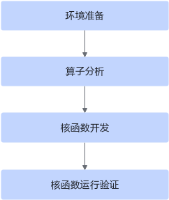

# PyAsc算子开发指南

本文档从一个简单的算子开发样例出发，带您体验基于pyasc的Ascend C算子开发基本流程。

> **注意**：本教程基于 [pyasc](https://gitcode.com/cann/pyasc) 项目，使用 Python 原生语法编写 Ascend C 算子，与 `.asc` 文件开发方式不同。

在正式的开发之前，需要先完成环境准备工作，开发 pyasc 算子的基本流程如下：



## 环境准备

- **pyasc 安装**

  pyasc 支持通过 pip 快速安装和基于源码编译安装两种方式。具体请参考 [pyasc 快速入门-编译环境准备](quick_start.md#buildenv)。

- **CANN 软件安装**

  开发算子前需要安装 CANN 软件。安装 CANN 软件后，需要设置环境变量。具体请参考 [pyasc 快速入门-运行环境准备](quick_start.md#runtimeenv)。

## 算子分析

主要分析算子的数学表达式、输入输出的数量、Shape 范围以及计算逻辑的实现，明确需要调用的 pyasc 接口。下文以 Add 算子为例，介绍具体的分析过程。

1. **明确算子的数学表达式及计算逻辑**

   Add 算子的数学表达式为：
   ```
   z = x + y
   ```

   计算逻辑是：从外部存储 Global Memory 搬运数据至内部存储 Local Memory，然后使用 pyasc 计算接口完成两个输入参数相加，得到最终结果，再搬运到 Global Memory 上。

2. **明确输入和输出**

   - Add 算子有两个输入：x 与 y，输出为 z
   - 本样例中算子输入支持的数据类型为 float，算子输出的数据类型与输入数据类型相同
   - 算子输入支持的 shape 为（8，2048），输出 shape 与输入 shape 相同
   - 算子输入支持的 format 为：ND

3. **确定核函数名称和参数**

   - 本样例中核函数命名为 `vadd_kernel`
   - 根据对算子输入输出的分析，确定核函数有 3 个参数 x，y，z；x，y 为输入参数，z 为输出参数

4. **确定算子实现所需接口**

   - 实现涉及外部存储和内部存储间的数据搬运，使用 [`asc.data_copy`](./python-api/language/generated/asc.language.basic.data_copy.md) 接口来实现数据搬移
   - 本样例只涉及矢量计算的加法操作，使用 [`asc.add`](./python-api/language/generated/asc.language.basic.add.md) 接口实现 x+y
   - 计算中使用到的 Tensor 数据结构，使用 [`asc.GlobalTensor`](./python-api/language/core.md)、[`asc.LocalTensor`](./python-api/language/core.md) 进行管理
   - 并行流水任务之间使用 [`asc.set_flag`](./python-api/language/generated/asc.language.basic.set_flag.md)/[`asc.wait_flag`](./python-api/language/generated/asc.language.basic.wait_flag.md) 接口完成同步

通过以上分析，得到 pyasc Add 算子的设计规格如下：

  <table>
  <tr><td rowspan="1" align="center">算子类型(OpType)</td><td colspan="5" align="center">Add</td></tr>
  </tr>
  <tr><td rowspan="3" align="center">算子输入</td><td align="center">name</td><td align="center">shape</td><td align="center">data type</td><td align="center">format</td></tr>
  <tr><td align="center">x</td><td align="center">(8, 2048)</td><td align="center">float</td><td align="center">ND</td></tr>
  <tr><td align="center">y</td><td align="center">(8, 2048)</td><td align="center">float</td><td align="center">ND</td></tr>
  </tr>
  </tr>
  <tr><td rowspan="1" align="center">算子输出</td><td align="center">z</td><td align="center">(8, 2048)</td><td align="center">float</td><td align="center">ND</td></tr>
  </tr>
  <tr><td rowspan="1" align="center">核函数名</td><td colspan="5" align="center">vadd_kernel</td></tr>
  <tr><td rowspan="4" align="center">使用的主要接口</td><td colspan="5" align="center">asc.data_copy：数据搬运接口</td></tr>
  <tr><td colspan="5" align="center">asc.add：矢量基础算术接口</td></tr>
  <tr><td colspan="5" align="center">asc.GlobalTensor/LocalTensor：内存管理接口</td></tr>
  <tr><td colspan="5" align="center">asc.set_flag/wait_flag：同步接口</td></tr>
  <tr><td rowspan="1" align="center">算子实现文件名称</td><td colspan="5" align="center">add.py</td></tr>
  </table>

---

## 核函数开发

完成环境准备和初步的算子分析后，即可开始 pyasc 核函数的开发。

本样例中使用多核并行计算，即把数据进行分片，分配到多个核上进行处理。pyasc 核函数是在一个核上的处理函数，所以只处理部分数据。分配方案是：假设共启用 8 个核，数据整体长度为 8 * 2048 个元素，平均分配到 8 个核上运行，每个核上处理的数据大小为 2048 个元素。对于单核上的处理数据，也可以进行数据切块，实现对数据的流水并行处理。

1. **定义核函数参数**

   本样例使用以下参数控制数据切分：
   - `USE_CORE_NUM = 8`：启用 8 个核
   - `TILE_NUM = 8`：每个核上数据分块个数
   - `BUFFER_NUM = 2`：双缓冲

2. **核函数定义与实现**

   使用 `@asc.jit` 装饰器定义核函数，并在核函数中实现算子逻辑：

   ```python
   import asc
   import asc.lib.runtime as rt

   USE_CORE_NUM = 8
   BUFFER_NUM = 2
   TILE_NUM = 8

   @asc.jit
   def vadd_kernel(x: asc.GlobalAddress, y: asc.GlobalAddress, z: asc.GlobalAddress, block_length: int):
       # 获取当前核的索引，计算数据偏移
       offset = asc.get_block_idx() * block_length
       
       # 创建 GlobalTensor 管理全局内存地址
       x_gm = asc.GlobalTensor()
       y_gm = asc.GlobalTensor()
       z_gm = asc.GlobalTensor()
       
       # 设置 Global Memory 起始地址和长度
       x_gm.set_global_buffer(x + offset, block_length)
       y_gm.set_global_buffer(y + offset, block_length)
       z_gm.set_global_buffer(z + offset, block_length)

       # 计算每个 tile 的长度（考虑双缓冲）
       tile_length = block_length // TILE_NUM // BUFFER_NUM

       # 获取数据类型信息
       data_type = x.dtype
       buffer_size = tile_length * BUFFER_NUM * data_type.sizeof()

       # 创建 LocalTensor（基于指定的逻辑位置/地址/长度）
       # x_local 和 y_local 放在 VECIN 位置
       x_local = asc.LocalTensor(data_type, asc.TPosition.VECIN, 0, tile_length * BUFFER_NUM)
       y_local = asc.LocalTensor(data_type, asc.TPosition.VECIN, buffer_size, tile_length * BUFFER_NUM)
       # z_local 放在 VECOUT 位置
       z_local = asc.LocalTensor(data_type, asc.TPosition.VECOUT, buffer_size + buffer_size, tile_length * BUFFER_NUM)

       # 流水循环处理（双缓冲需要循环次数翻倍）
       for i in range(TILE_NUM * BUFFER_NUM):
           buf_id = i % BUFFER_NUM

           # Step 1: 搬入 - 从 Global Memory 拷贝数据到 Local Memory
           asc.data_copy(x_local[buf_id * tile_length:], x_gm[i * tile_length:], tile_length)
           asc.data_copy(y_local[buf_id * tile_length:], y_gm[i * tile_length:], tile_length)

           # 同步：等待 MTE2_V 事件，确保数据搬入完成
           asc.set_flag(asc.HardEvent.MTE2_V, buf_id)
           asc.wait_flag(asc.HardEvent.MTE2_V, buf_id)

           # Step 2: 计算 - 执行矢量加法
           asc.add(z_local[buf_id * tile_length:], x_local[buf_id * tile_length:], 
                   y_local[buf_id * tile_length:], tile_length)

           # 同步：等待 V_MTE3 事件，确保计算完成
           asc.set_flag(asc.HardEvent.V_MTE3, buf_id)
           asc.wait_flag(asc.HardEvent.V_MTE3, buf_id)

           # Step 3: 搬出 - 从 Local Memory 拷贝数据到 Global Memory
           asc.data_copy(z_gm[i * tile_length:], z_local[buf_id * tile_length:], tile_length)

           # 同步：等待 MTE3_MTE2 事件，确保数据搬出完成
           asc.set_flag(asc.HardEvent.MTE3_MTE2, buf_id)
           asc.wait_flag(asc.HardEvent.MTE3_MTE2, buf_id)
   ```

   **内部函数的调用关系示意图**：

   ```
   vadd_kernel
   ├── offset = get_block_idx() * block_length
   ├── GlobalTensor 设置
   │   ├── x_gm.set_global_buffer()
   │   ├── y_gm.set_global_buffer()
   │   └── z_gm.set_global_buffer()
   ├── LocalTensor 创建
   └── for i in range(TILE_NUM * BUFFER_NUM):
       ├── CopyIn: data_copy (x_local, y_local <- x_gm, y_gm)
       ├── Compute: add (z_local <- x_local + y_local)
       └── CopyOut: data_copy (z_gm <- z_local)
   ```

3. **Launch 函数实现**

   ```python
   def vadd_launch(x: torch.Tensor, y: torch.Tensor) -> torch.Tensor:
       z = torch.zeros_like(x)

       total_length = z.numel()
       block_length = total_length // USE_CORE_NUM

       vadd_kernel[USE_CORE_NUM, rt.current_stream()](x, y, z, block_length)
       return z
   ```

   - `vadd_kernel[USE_CORE_NUM, rt.current_stream()]`：使用内核调用符指定核数和流
   - `(x, y, z, block_length)`：传递参数

---

## 核函数运行验证

完成核函数开发后，即可编写完整的核函数调用程序，执行计算过程。

1. **完整的算子验证程序**

   ```python
   import logging
   import argparse
   import torch
   try:
       import torch_npu
   except ModuleNotFoundError:
       pass

   import asc
   import asc.runtime.config as config
   import asc.lib.runtime as rt

   USE_CORE_NUM = 8
   BUFFER_NUM = 2
   TILE_NUM = 8

   logging.basicConfig(level=logging.INFO)

   @asc.jit
   def vadd_kernel(x: asc.GlobalAddress, y: asc.GlobalAddress, z: asc.GlobalAddress, block_length: int):
       offset = asc.get_block_idx() * block_length
       x_gm = asc.GlobalTensor()
       y_gm = asc.GlobalTensor()
       z_gm = asc.GlobalTensor()
       x_gm.set_global_buffer(x + offset, block_length)
       y_gm.set_global_buffer(y + offset, block_length)
       z_gm.set_global_buffer(z + offset, block_length)

       tile_length = block_length // TILE_NUM // BUFFER_NUM

       data_type = x.dtype
       buffer_size = tile_length * BUFFER_NUM * data_type.sizeof()

       x_local = asc.LocalTensor(data_type, asc.TPosition.VECIN, 0, tile_length * BUFFER_NUM)
       y_local = asc.LocalTensor(data_type, asc.TPosition.VECIN, buffer_size, tile_length * BUFFER_NUM)
       z_local = asc.LocalTensor(data_type, asc.TPosition.VECOUT, buffer_size + buffer_size, tile_length * BUFFER_NUM)

       for i in range(TILE_NUM * BUFFER_NUM):
           buf_id = i % BUFFER_NUM

           asc.data_copy(x_local[buf_id * tile_length:], x_gm[i * tile_length:], tile_length)
           asc.data_copy(y_local[buf_id * tile_length:], y_gm[i * tile_length:], tile_length)

           asc.set_flag(asc.HardEvent.MTE2_V, buf_id)
           asc.wait_flag(asc.HardEvent.MTE2_V, buf_id)

           asc.add(z_local[buf_id * tile_length:], x_local[buf_id * tile_length:], 
                   y_local[buf_id * tile_length:], tile_length)

           asc.set_flag(asc.HardEvent.V_MTE3, buf_id)
           asc.wait_flag(asc.HardEvent.V_MTE3, buf_id)

           asc.data_copy(z_gm[i * tile_length:], z_local[buf_id * tile_length:], tile_length)

           asc.set_flag(asc.HardEvent.MTE3_MTE2, buf_id)
           asc.wait_flag(asc.HardEvent.MTE3_MTE2, buf_id)

   def vadd_launch(x: torch.Tensor, y: torch.Tensor) -> torch.Tensor:
       z = torch.zeros_like(x)
       total_length = z.numel()
       block_length = total_length // USE_CORE_NUM
       vadd_kernel[USE_CORE_NUM, rt.current_stream()](x, y, z, block_length)
       return z

   # Backend 对应执行脚本时传入的 [RUN_MODE]
   # Platform 对应执行脚本时传入的 [SOC_VERSION]
   def vadd_custom(backend: config.Backend, platform: config.Platform):
       config.set_platform(backend, platform)
       device = "npu" if config.Backend(backend) == config.Backend.NPU else "cpu"
       size = 8 * 2048
       x = torch.rand(size, dtype=torch.float32, device=device)
       y = torch.rand(size, dtype=torch.float32, device=device)
       z = vadd_launch(x, y)
       assert torch.allclose(z, x + y)

   if __name__ == "__main__":
       parser = argparse.ArgumentParser()
       parser.add_argument("-r", type=str, default="Model", help="backend to run")
       parser.add_argument("-v", type=str, default=None, help="platform to run")
       args = parser.parse_args()
       backend = args.r
       platform = args.v
       if backend not in config.Backend.__members__:
           raise ValueError("Unsupported Backend! Supported: ['Model', 'NPU']")
       backend = config.Backend(backend)
       if platform is not None:
           platform_values = [platform.value for platform in config.Platform]
           if platform not in platform_values:
               raise ValueError(f"Unsupported Platform! Supported: {platform_values}")
           platform = config.Platform(platform)
       logging.info("[INFO] start process sample add.")
       vadd_custom(backend, platform)
       logging.info("[INFO] Sample add run success.")
   ```

2. **编译和运行**

   运行时使用以下命令：

   ```bash
   python3 add.py -r [RUN_MODE] -v [SOC_VERSION]
   ```

   其中：
   - `RUN_MODE`：编译执行方式，可选择 `Model`（仿真）或 `NPU`（上板）。
   - `SOC_VERSION`：昇腾 AI 处理器型号，如果无法确定具体的[SOC_VERSION]，则在安装昇腾AI处理器的服务器执行npu-smi info命令进行查询，在查询到的“Name”前增加Ascend信息，例如“Name”对应取值为xxxyy，实际配置的[SOC_VERSION]值为Ascendxxxyy。

   示例：
   ```bash
   # 仿真器模式运行
   python3 add.py -r Model -v Ascend910B1

   # NPU 上板模式运行
   python3 add.py -r NPU -v Ascend910B1
   ```

   用例执行完成，打屏信息出现 `Sample add run success.`，说明样例执行成功。

---

## pyasc 与 Ascend C 算子开发接口/语法特性的对比

| 特性 | Ascend C (.asc) | pyasc (Python) |
|------|-----------------|----------------|
| **编程语言** | C++ 扩展语法 | 原生 Python |
| **核函数定义** | `__global__ __aicore__` | `@asc.jit` 装饰器 |
| **GlobalTensor** | `AscendC::GlobalTensor<T>` | `asc.GlobalTensor()` |
| **LocalTensor** | `AscendC::LocalTensor<T>` | `asc.LocalTensor()` |
| **数据搬运** | `AscendC::DataCopy()` | `asc.data_copy()` |
| **矢量计算** | `AscendC::Add()` | `asc.add()` |
| **同步事件** | `AscendC::SetFlag()/WaitFlag()` | `asc.set_flag()/wait_flag()` |
| **核函数调用** | `add_custom<<<...>>>()` | `vadd_kernel[num_blocks, stream]()` |

---

## 接下来的引导

- 如果您想了解更多 pyasc 算子示例，可以参考 [tutorials](../python/tutorials) 目录下的样例。

- 如果您想深入了解 pyasc 的 API 接口，请参考 [API 文档](./python-api/index.md)。

- 如果您想了解 pyasc 的构建和调试方法，请参考 [快速入门](quick_start.md)。
